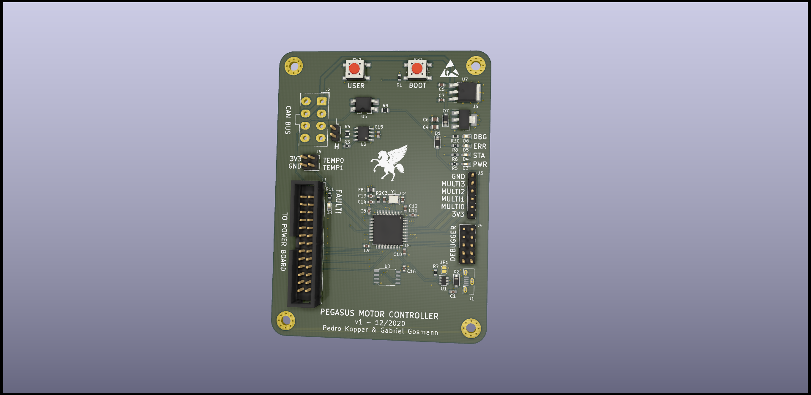

# Placa de controle

---

---

Essa placa é responsável por realizar o acionamento e controle dos motores. Utilizando um STM32F303, ela é capaz de medir a corrente ou força eletromotriz reversa de cada fase, possibilitando a comutação das bobinas. Além disso, possui entradas para sensores Hall, permitindo o uso de motores sensorados. 

Além do acionamento do motor, a placa realiza a comunicação com o resto do carro via barramento CAN, possibilitando o ajuste remoto de torque. Também possui uma entrada para o barramento de falha do carro, que desativa automaticamente a saída em caso de pane em qualquer um dos sistemas. Entradas para termistores permitem o monitoramento contínuo da temperatura da ponte do inversor, possibilitando o desarme em caso de sobreaquecimento. O monitoramento da tensão da bateria permite que as saídas sejam desligadas em caso de sobre/subtensão.

Com fim de telemetria, a placa conta com uma memória flash de 128Mbits, que pode ser lida através de conexão USB para possibilitar a caracterização da performance do inveersor e do motor, diagnosticar panes, entre outros.

---

Esse design é hardware livre e é disponibilizado através da licença CERN-OHL-S v2 (fortemente recíproca), disponível em inglês [aqui](https://ohwr.org/cern_ohl_s_v2.txt).
